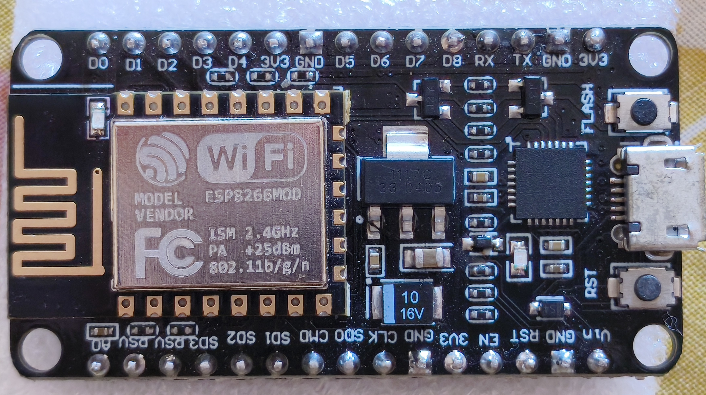
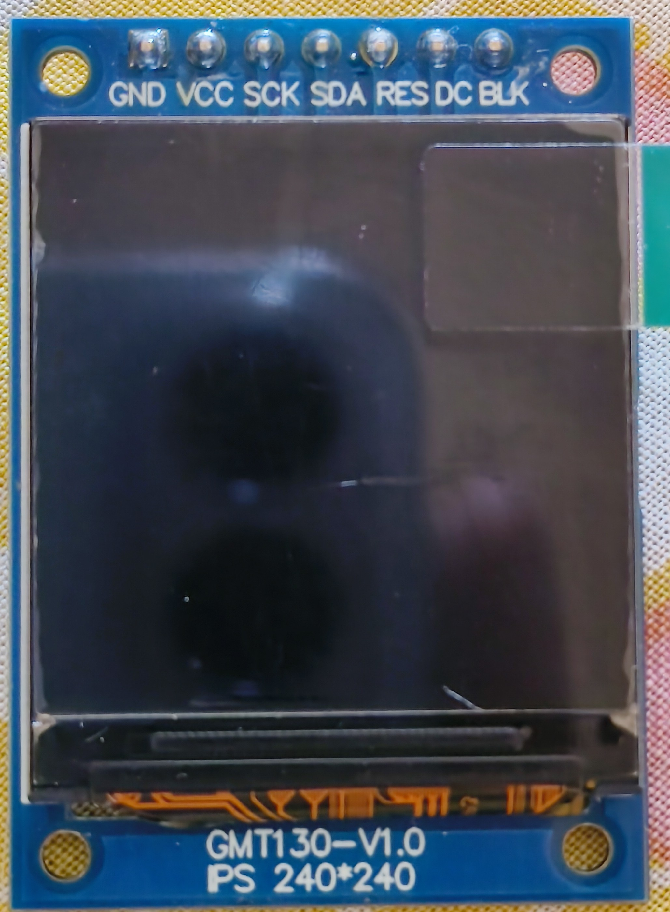
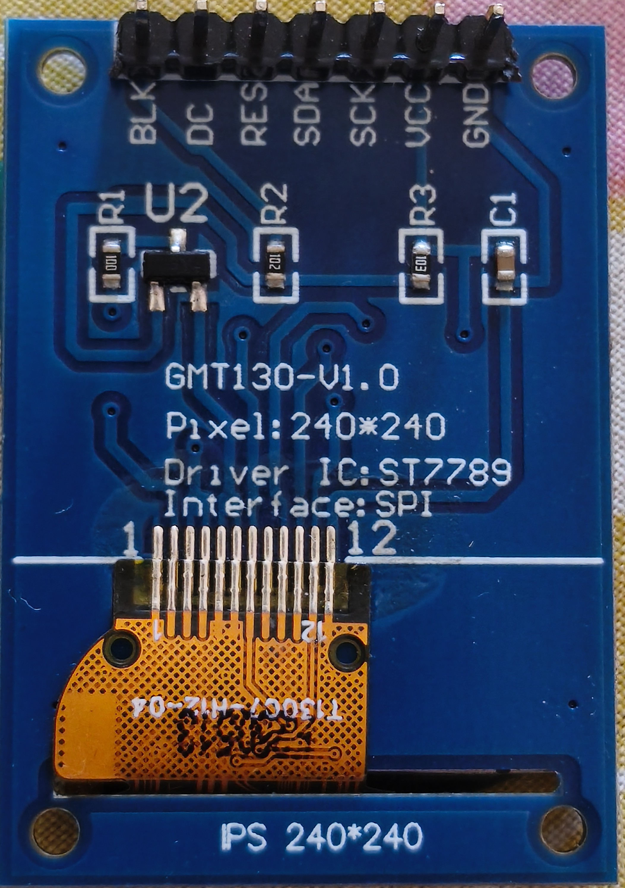
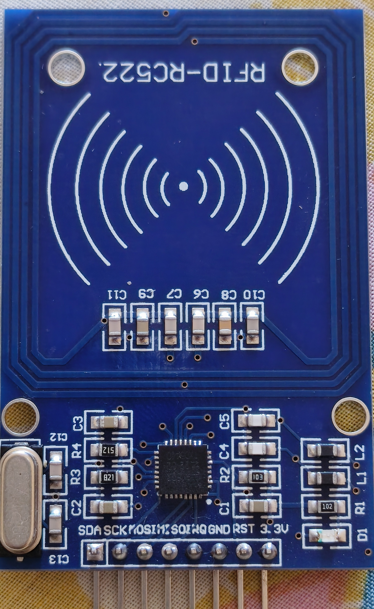

# Student Attendance Registration System

## Project Hardware Overview

A smart **RFID-based attendance system** using **NodeMCU ESP8266**.  
The system reads RFID cards, sends data to a server, and displays results on a TFT screen with audio and visual feedback.

---

## Features

- RFID card detection using MFRC522
- WiFi-based attendance logging
- Color TFT display (ST7789 1.3" 240x240)
- RGB LED status indication (Green = Authorized, Red = Unauthorized)
- Active buzzer feedback
- Real-time server communication (HTTP API)
- User database with names and IDs
- Duplicate attendance detection

---

## Hardware Components

- **Microcontroller**: NodeMCU ESP8266
- **RFID Module**: MFRC522 (13.56 MHz)
- **Display**: 1.3 inch TFT LCD (ST7789 Driver, 240x240)
- **Buzzer**: 5V Active Buzzer
- **RGB LED**: Common Anode RGB LED
- **Power Supply**: 3.3V

---

## Pin Connections

| Component | Pin Function | NodeMCU Pin | Notes              |
| --------- | ------------ | ----------- | ------------------ |
| RFID      | SDA / SS     | D8          | Chip Select        |
| RFID      | SCK          | D5          | Shared SPI         |
| RFID      | MOSI         | D7          | Shared SPI         |
| RFID      | MISO         | D6          | -                  |
| RFID      | RST          | D3          | Reset              |
| TFT       | SCK          | D5          | Shared             |
| TFT       | MOSI (SDA)   | D7          | Shared             |
| TFT       | RST          | D0          | Reset              |
| TFT       | DC           | D1          | Data/Command       |
| TFT       | BLK          | 3v3         | Display Brightness |
| Buzzer    | Signal       | D2          | Active Buzzer      |
| RGB LED   | Red          | D4          | -                  |
| RGB LED   | Green        | RX          | -                  |
| Power     | VCC          | 3V3         | All components     |
| Power     | GND          | GND         | Common Ground      |

---

## ⚠️ Important Notes

- All components must run on **3.3V**
- Ensure common ground between all components

---

## Components images


<br>
<br>

<br>
<br>

<br>
<br>


---

## Required Libraries

- `SPI` (Built-in)
- `ESP8266WiFi` (built-in)
- `ESP8266HTTPClient` (built-in)  
  Fast communication protocol used to connect the **RFID Module** and **TFT Display** with the NodeMCU.

- `MFRC522` by [miguelbalboa](https://github.com/miguelbalboa/rfid)  
  Official and popular library for reading and writing **13.56MHz RFID** cards and tags using the RC522 module.

- `TFT_eSPI` by [Bodmer](https://github.com/Bodmer/TFT_eSPI)  
  A powerful and highly optimized library for TFT and IPS displays.  
  Used in this project to display "Welcome" messages, user names, IDs, and the "Scan Card" screen with animation.

---

## TFT_eSPI Setup (Very Important)

### 1. Go to: `Documents/Arduino/libraries/TFT_eSPI/User_Setup.h`

### 2. Enable the ST7789 driver and configure the pins as follows:

```cpp
#define ST7789_DRIVER

#define TFT_WIDTH  240
#define TFT_HEIGHT 240

#define TFT_MOSI   D7
#define TFT_SCLK   D5
#define TFT_DC     D1
#define TFT_RST    D0
#define TFT_CS     -1

#define LOAD_GLCD
#define LOAD_FONT2
#define LOAD_FONT4
#define LOAD_FONT6
#define LOAD_FONT7
#define LOAD_FONT8

#define SPI_FREQUENCY  27000000
```

### 3. TFT_eSPI Configuration Explanation

This configuration is done in the file **`User_Setup.h`** inside the TFT_eSPI library folder. It tells the library how to work with our specific display.

```cpp
#define ST7789_DRIVER
```

→ Activates the driver for the ST7789 chip used in our 1.3 inch TFT display.

```cpp
#define TFT_WIDTH  240
#define TFT_HEIGHT 240
```

→ Defines the resolution of the screen (240x240 pixels).

```cpp
#define TFT_MOSI   D7
#define TFT_SCLK   D5
#define TFT_DC     D1
#define TFT_RST    D0
#define TFT_CS     -1
```

### Pins Explanation:

TFT_MOSI (D7) & TFT_SCLK (D5): Hardware SPI pins (shared with RFID module).

TFT_DC (D1): Data/Command pin – tells the display whether we’re sending data or commands.

TFT_RST (D0): Reset pin – used to reset the display at startup.

TFT_CS (-1): Chip Select is set to -1 because most cheap ST7789 modules don’t have a CS pin or it’s always active.

```cpp
#define LOAD_GLCD
#define LOAD_FONT2
#define LOAD_FONT4
#define LOAD_FONT6
#define LOAD_FONT7
#define LOAD_FONT8
```

→ Loads different font sizes into memory so we can use them in the code (e.g. font 4 for big text, font 2 for smaller text).

```cpp
#define SPI_FREQUENCY  27000000
```

→ Sets the SPI communication speed to 27 MHz. Higher speed = smoother and faster screen updates (good for animation and text).

## Summary:

This setup configures the TFT_eSPI library to properly communicate with our ST7789 240x240 display using the correct pins and optimal speed on the ESP8266 NodeMCU.

---

<br>

# RFID RC522 (13.56 MHz):

## Introduction

**RFID (Radio Frequency Identification)** is a wireless technology that uses electromagnetic fields to automatically identify and track tags attached to objects or people.

This project implements a **smart RFID-based Access Control System** using the popular **NodeMCU ESP8266** microcontroller. The system can read RFID cards, verify user identity, and provide instant visual and audio feedback.

### How RFID Works

RFID systems consist of two main components:

- **RFID Reader** (in this project: MFRC522 module)
- **RFID Tag/Card** (passive 13.56 MHz cards)

When a card is brought near the reader, the reader generates a high-frequency electromagnetic field that powers the card. The card then transmits its unique identification number (**UID**) back to the reader.

---

### Project Purpose

This system is designed as a **Student Attendance Registration System** using RFID technology. It aims to:

- Automatically record student attendance in classrooms or labs
- Identify students quickly and accurately using their RFID cards
- Display student name and ID on a TFT screen upon card scan
- Provide instant visual feedback (Green = Present, Red = Unknown)
- Give audio confirmation with a buzzer
- Reduce manual attendance taking and minimize errors

### Why This Project?

- Saves time for instructors and reduces paperwork
- Provides accurate and timestamped attendance records
- Low cost and easy to build
- Fast and reliable student identification

---

# esp Code Explanation

- Libraries

```cpp
#include <SPI.h>
#include <MFRC522.h>
#include <TFT_eSPI.h>
#include <ESP8266WiFi.h>
#include <ESP8266HTTPClient.h>
```

- Pins

```cpp
#define SS_PIN D8
#define RST_PIN D3
#define BUZZER D2
#define RGB_RED D4
#define RGB_GREEN D1
```

- WiFi Setup

```cpp
const char *WIFI_SSID = "YOUR_WIFI";
const char *WIFI_PASSWORD = "YOUR_PASSWORD";
const char *SERVER_URL = "http://your-server/api/scan.php";
```

- Hardware Setup

```cpp
MFRC522 rfid(SS_PIN, RST_PIN);
// This line creates an RFID reader object named rfid using the MFRC522 library.
// It tells the program which pins are used for chip select (SS) and reset (RST) so it can communicate with the RFID module.
TFT_eSPI tft = TFT_eSPI();
// This line creates a display object named tft using the TFT_eSPI library.
// It allows the program to control the TFT screen (draw text, shapes, etc.) using the configuration defined in User_Setup.h.
```

- RGB LED

```cpp
void setRGB(bool r, bool g) {
  analogWrite(RGB_RED, r ? 0 : 255);
  analogWrite(RGB_GREEN, g ? 0 : 255);
} // Controls the RGB LED by turning red and green ON or OFF based on input values (for status indication).

void clearRGB() {
  analogWrite(RGB_RED, 255);
  analogWrite(RGB_GREEN, 255);
} // Turns OFF all RGB LED colors (resets LED to no light).
```

- Buzzer Setup

```cpp
void beepSuccess() {
  digitalWrite(BUZZER, HIGH);
  delay(200);
  digitalWrite(BUZZER, LOW);
} // Plays a short single beep to indicate a successful operation.

void beepError() {
  for (int i = 0; i < 2; i++) {
    digitalWrite(BUZZER, HIGH);
    delay(100);
    digitalWrite(BUZZER, LOW);
    delay(100);
  }
} // Plays two short beeps to indicate an error or invalid action.
```

- TFT Functions (Display)

```cpp
void tftClear() {}
// Clears the TFT screen by filling it ALl Black(reset display).

void showWaiting() {}
// Displays a "waiting for RFID scan" screen on the TFT with centered messages ("Scan Card" and "Ready") and resets the RGB LEDs to indicate the system is idle and ready for a new card.

void showConnecting() {}
// Displays a "connecting to WiFi" screen on the screen with centered messages to indicate the system is currently attempting to establish a network connection.

void showSuccess(String name, String sid) {}
// Displays a success screen showing a welcome message with the user's name and ID, indicating that attendance has been successfully recorded.

void showAlready(String name) {}
// Displays a warning screen indicating that attendance has already been recorded for the given user, along with their name.

void showUnknown(String uid) {}
// Displays an error screen indicating an unrecognized RFID card, along with its UID.
```

- JSON Parsing

```cpp
String parseJSON(String json, String key)
{
  String search = "\"" + key + "\":\"";
  int idx = json.indexOf(search);
  if (idx == -1)
    return "";
  idx += search.length();
  int end = json.indexOf("\"", idx);
  return json.substring(idx, end);
} // Extracts and returns the value of a given key from a simple JSON string (assumes "key":"value" format).
```
- Send UID to Server
```cpp
void sendUID(String uid)
{
  // Check if WiFi is connected before sending request
  if (WiFi.status() != WL_CONNECTED)
  {
    Serial.println("[WiFi] Not connected, skipping");
    return;
  }

  // Create client and HTTP objects
  WiFiClient client;
  HTTPClient http;

  // Initialize HTTP connection with server URL
  http.begin(client, SERVER_URL);

  // Set request header to indicate JSON data
  http.addHeader("Content-Type", "application/json");

  // Set timeout for the request (5 seconds)
  http.setTimeout(5000);

  // Create JSON payload containing the UID
  String payload = "{\"uid\":\"" + uid + "\"}";

  // Send POST request and store response code
  int code = http.POST(payload);

  // Print HTTP response code for debugging
  Serial.print("[HTTP] Code: ");
  Serial.println(code);

  // If request was successful (HTTP 200 OK)
  if (code == 200)
  {
    // Get response body from server
    String body = http.getString();
    Serial.println("[HTTP] Response: " + body);

    // Extract values from JSON response
    String status = parseJSON(body, "status");        // success / error
    String name = parseJSON(body, "name");            // student name
    String sid = parseJSON(body, "student_id");       // student ID

    // If card is valid and attendance recorded
    if (status == "success")
    {
      beepSuccess();           // Play success sound
      setRGB(false, true);    // Turn LED green

      // Check if attendance was already marked
      if (body.indexOf("\"already\":true") >= 0)
      {
        showAlready(name);    // Show "already marked" screen
      }
      else
      {
        showSuccess(name, sid); // Show success screen with name and ID
      }
    }
    else
    {
      // Card not recognized by server
      beepError();           // Play error sound
      setRGB(true, false);  // Turn LED red
      showUnknown(uid);     // Show unknown card screen
    }
  }
  else
  {
    // HTTP request failed (server error, timeout, etc.)
    Serial.println("[HTTP] Error: " + http.errorToString(code));

    beepError(); // Play error sound

    // Display error message on TFT
    tftClear();
    tft.setTextDatum(MC_DATUM);
    tft.setTextColor(TFT_RED);
    tft.drawString("Server Error", tft.width() / 2, tft.height() / 2, 4);
  }

  // Close HTTP connection and free resources
  http.end();
}
```

- Setup Function
```cpp
void setup()
{
  // Initialize serial communication for debugging
  Serial.begin(115200);
  delay(100);

  // Initialize TFT display
  tft.init();
  tft.setRotation(0); // Set screen orientation
  tftClear();         // Clear screen

  // Configure output pins for buzzer and RGB LED
  pinMode(BUZZER, OUTPUT);
  pinMode(RGB_RED, OUTPUT);
  pinMode(RGB_GREEN, OUTPUT);
  clearRGB(); // Turn off RGB LED initially

  // Start WiFi connection process
  showConnecting(); // Display "Connecting" screen
  Serial.print("[WiFi] Connecting");

  WiFi.begin(WIFI_SSID, WIFI_PASSWORD); // Connect using credentials

  int tries = 0;

  // Attempt to connect to WiFi for a limited time (about 15 seconds)
  while (WiFi.status() != WL_CONNECTED && tries < 30)
  {
    delay(500);         // Wait before retry
    Serial.print(".");  // Show progress in serial monitor
    tries++;
  }

  // If connected successfully
  if (WiFi.status() == WL_CONNECTED)
  {
    Serial.println("\n[WiFi] Connected: " + WiFi.SSID());

    // Display success message on TFT
    tftClear();
    tft.setTextDatum(MC_DATUM);
    tft.setTextColor(TFT_GREEN);
    tft.drawString("Connected!", tft.width() / 2, tft.height() / 2 - 15, 4);
    delay(1500); // Wait before continuing
  }
  else
  {
    // If WiFi connection failed
    Serial.println("\n[WiFi] FAILED - running offline");

    // Display error message on TFT
    tftClear();
    tft.setTextDatum(MC_DATUM);
    tft.setTextColor(TFT_RED);
    tft.drawString("WiFi Failed", tft.width() / 2, tft.height() / 2, 4);
    delay(2000); // Give user time to see error
  }

  // Initialize SPI communication for RFID module
  SPI.begin();

  // Initialize RFID reader
  rfid.PCD_Init();
  Serial.println("[RFID] Reader ready");

  // Show idle screen waiting for card scan
  showWaiting();
}
```

- Loop Function
```cpp
void loop()
{
  // Check if a new RFID card is present AND readable
  if (!rfid.PICC_IsNewCardPresent() || !rfid.PICC_ReadCardSerial())
    return; // Exit loop if no card detected

  // Build UID string from card bytes
  String uid = "";
  for (byte i = 0; i < rfid.uid.size; i++)
  {
    // Add leading zero if value is less than 0x10 (for proper formatting)
    if (rfid.uid.uidByte[i] < 0x10)
      uid += "0";

    // Convert byte to HEX and append to UID string
    uid += String(rfid.uid.uidByte[i], HEX);
  }

  uid.toUpperCase(); // Convert UID to uppercase format
  Serial.println("UID: " + uid); // Print UID for debugging

  // Send UID to server for validation and attendance marking
  sendUID(uid);

  // Wait before allowing next scan (prevents duplicate fast reads)
  delay(2500);

  // Show waiting screen again after processing
  showWaiting();

  // Halt current RFID communication
  rfid.PICC_HaltA();

  // Stop encryption on RFID reader
  rfid.PCD_StopCrypto1();
}
```